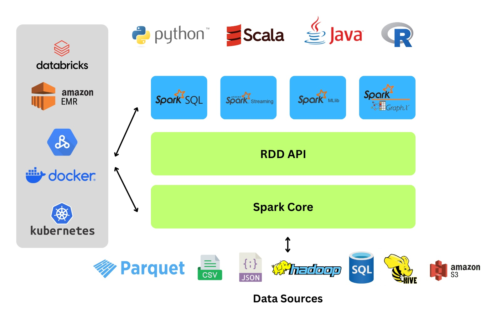

# Apache Spark — Beginner Notes 🚀

## What is Spark?

Apache Spark is a **distributed unified analytics engine**.

In simple words:

> Spark splits huge data work across many computers and combines the final result.

---

# Why is Spark called “Unified”?

Because Spark can do:

- SQL Queries
- Streaming
- Machine Learning
- Batch Processing
- Graph Processing

…all inside ONE engine.

```text
           Apache Spark
        ┌───────────────┐
        │ SQL           │
        │ Streaming     │
        │ Machine Learn │
        │ Graphs        │
        │ Big Data ETL  │
        └───────────────┘
```

---

# Why Spark Exists

Imagine processing:

```text
1 BILLION rows of data
```

One computer becomes slow.

Spark solves this by distributing work across many machines.

---

# Spark Architecture

```text
                You
                 │
                 ▼
          Write Spark Code
                 │
                 ▼
          ┌─────────────┐
          │ Spark Driver│
          └─────────────┘
                 │
     ┌───────────┼───────────┐
     ▼           ▼           ▼
 ┌────────┐ ┌────────┐ ┌────────┐
 │Worker 1│ │Worker 2│ │Worker 3│
 └────────┘ └────────┘ └────────┘
     │           │           │
   Task         Task        Task
```

---

# Example

```python
df.groupBy("city").avg("fare")
```

Spark internally:

```text
Read Data
   ↓
Group By City
   ↓
Average Fare
```

Then:

```text
Split work across machines
        ↓
Parallel processing
        ↓
Combine final result
```

---

# Most Important Concept — Lazy Evaluation

Spark is **lazy**.

```text
You write operations
        ↓
Spark builds DAG
        ↓
Waits
        ↓
Action called
        ↓
Now executes everything
```

---

# Transformations vs Actions

## Transformations

```python
filter()
groupBy()
select()
map()
```

## Actions

```python
show()
count()
collect()
write()
```

---

# Final Mental Model

```text
Your Code
   ↓
Spark builds DAG
   ↓
Splits work into tasks
   ↓
Distributes tasks across machines
   ↓
Parallel execution
   ↓
Final result returned
```

---

# One-Line Definition

> Apache Spark is a distributed engine that processes massive datasets by dividing computations across multiple machines in parallel.

---

# Spark Ecosystem

## The Unified Stack Architecture

The image below illustrates Apache Spark as a layered, unified stack where higher-level libraries rely on the core engine, allowing developers to use different languages and data sources seamlessly.



> Image Source: Apache Spark Ecosystem Architecture Diagram

---

## 1. Language APIs (Top Layer)

At the very top, the diagram shows support for four major programming languages:

- Python
- Scala
- Java
- R

This flexibility allows Data Engineers and Data Scientists to interact with Spark using the language they are most comfortable with, without needing to learn low-level cluster programming.

---

## 2. Domain-Specific Libraries (Blue Layer)

The four blue boxes represent Spark's built-in libraries that handle specific data workload types:

- **Spark SQL**: For processing structured data using SQL queries and DataFrames.
- **Spark Streaming**: For ingesting and processing real-time data streams.
- **Spark MLlib**: A library of machine learning algorithms for tasks like classification and clustering.
- **Spark GraphX**: For graph computation and network analysis.

---

## 3. The Core Engine (Green Layers)

The foundation of the stack is depicted by the two green bars: Spark Core and the RDD API.

- **Spark Core**: This is the underlying execution engine responsible for memory management, task scheduling, and fault recovery.
- **RDD API**: Sitting directly on top of the core, this exposes the Resilient Distributed Dataset abstraction, which is the fundamental data structure Spark uses to process data in parallel across the cluster.

---

## 4. Deployment Environment (Left Panel)

The "Environment" section on the left illustrates that Spark is decoupled from the resource manager. It can run in various environments:

- Containerized: Using Docker or Kubernetes.
- Cloud: On services like Amazon EC2, Databricks, Google DataProc.
- Cluster Managers: Natively on Mesos or OpenStack.

---

## 5. Data Sources (Bottom Layer)

The bottom section shows Spark's ability to connect to a wide variety of data storage systems. Instead of locking you into a single storage format, it can ingest data from:

- Cloud Storage: ADLS, GCS, AWS S3.
- Hadoop Ecosystem: HDFS (Hadoop), Hive, and HBase.
- NoSQL Databases: Cassandra, Elasticsearch, MongoDB, Redis, and DynamoDB.
- Relational Databases: MySQL, PostgreSQL, Oracle, SQL Server, and Redshift.
- Flat Files: CSV, JSON, Parquet, Avro, and ORC formats.
- Streaming Sources: Apache Kafka, Kinesis, and event hubs for real-time data ingestion.
- Cloud Data Warehouses: Snowflake, BigQuery, and Databricks Delta Lake.

Spark achieves this flexibility through connectors - specialized libraries that enable reading and writing to specific systems. Many are built-in, while others are available through third-party packages that you can add to your Spark application.

---

# Spark Shuffle Cheat Sheet

This table summarizes when shuffles happen in Spark and whether you need to adjust `spark.sql.shuffle.partitions`.

| Data Type                  | Operation                              | Shuffle Happens? | Adjust `spark.sql.shuffle.partitions`? | Notes                                                                 |
|-----------------------------|----------------------------------------|-----------------|----------------------------------------|-----------------------------------------------------------------------|
| CSV / Parquet / DataFrame   | `select`, `filter`, `withColumn`       | ❌ No            | ❌ Not needed                           | Row-wise operations, each partition can work independently           |
|                             | `groupBy`, `join`, `distinct`, `aggregate` | ✅ Yes           | ✅ Yes, especially on local machine or large dataset | Spark moves rows so related keys end up in the same partition        |
| Spark SQL Queries           | `SELECT ... WHERE ...`                  | ❌ No            | ❌ Not needed                           | Simple filtering / selecting columns → no shuffle                    |
|                             | `SELECT key, COUNT(*) FROM table GROUP BY key` | ✅ Yes           | ✅ Yes                                   | `GROUP BY` triggers shuffle                                           |
|                             | `JOIN table1 t1 ON t1.id = t2.id`      | ✅ Yes           | ✅ Yes                                   | Data from different partitions must come together                    |
| Streaming DataFrames        | `select`, `filter`, `withColumn`       | ❌ No            | ❌ Not needed                           | Row-wise operation in micro-batch                                     |
|                             | `groupBy(window, key).count(), aggregations` | ✅ Yes           | ✅ Yes                                   | Windowed aggregations / streaming joins → shuffle occurs             |
|                             | `join` with another stream or batch    | ✅ Yes           | ✅ Yes                                   | Shuffle needed to match keys across streams                           |

## Quick Tips for `spark.sql.shuffle.partitions`

- **Local / Small Datasets**
  - Reduce partitions to ~2 × number of cores.
  - Avoid creating hundreds of tiny tasks.

- **Production / Big Data**
  - Default is `200`, but this may be too low for TB-scale datasets.
  - Increase if each partition is huge → helps avoid OOM (Out Of Memory) errors.

- **Rule of Thumb**
  - **No shuffle** → ignore `spark.sql.shuffle.partitions`.
  - **Shuffle** → adjust `spark.sql.shuffle.partitions` accordingly.
